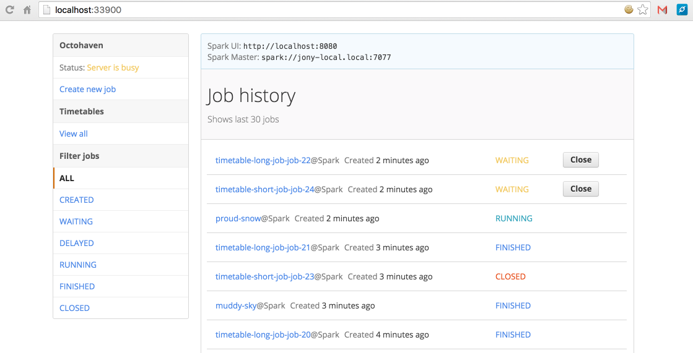

# octohaven
Super simple Apache Spark job server.

- [Overview](#overview)
- [Install](#install)
- [Run](#run)
    - [Quick test](#quick-test)
    - [Application logs](#application-logs)
    - [Spark job logs](#spark-job-logs)
- [Configuration](#configuration)
- [Build and test](#build-and-test)
- [Contribute](#contribute)

## Overview
Simple Spark job scheduler, allows to run created, delayed or periodic jobs with selected `jar` and
Spark / job configuration options.

Features:
- delayed jobs (run after some time passed)
- periodic jobs (run jobs periodically using timetables and Cron expressions)
- view `stdout` / `stderr` of jobs using UI and etc.

Goodies:
- does not mess up with Spark cluster installation and/or scripts (more like nice feature, which
    you can easily turn on/off any time)

Others:
- Tested only with Spark standalone cluster, not sure if it will work with Yarn or Mesos

Screenshot of the UI:


## Install
Super simple installation and no dependencies, except Python 2.7.x, and Redis.
Uses Docker to set up Redis, but can use your own Redis instance, see [Configuration](#configuration).
Web UI is built using [Primer](http://primercss.io/) with some modifications to suit my purposes.


## Run
Download repository and run scripts from `sbin` directory.
To run service execute `start.sh` script, to stop service - `stop.sh`. Application will be
available on `localhost:33900` or whatever host and port you will have specified in `config.sh`.

```shell
# start service, this will load configuration from config.sh
$ sbin/start.sh
```

```shell
# stop service
$ sbin/stop.sh
```

Note that `start.sh` supports some command-line arguments (again, this are just a few options, will
add more in the future):
- `-d` or `--daemon=true/false` => launch service as daemon process, which means logging will be
only available in a log file _octohaven-service.log_. If option is not specified, launches as
normal process, equivalent to `--daemon=false`. Usage: `sbin/start.sh -d` or
`sbin/start.sh --daemon=true`
- `--usage` or `--help` => displays usage of the script

Application will be available on `localhost:33900` or whatever port you specify in configuration
file.

### Quick test
There is a jar file in distribution, so you can try running sample Spark job out of the box.
Settings are:
- **entrypoint** org.test.SparkSum
- **jar** projectDir/test/resources/filelist/prod/start-sbt-app_2.10-0.0.1.jar
- **jobconf** any number up to max integer

Job will report sum of numbers between 0 and number specified.

> You can also schedule that job using `Schedule job` on left side menu. This will create timetable
> to run your job periodically, again it is all accessible through UI.

### Application logs
Application logs stored in project directory in a file/many files **octohaven-service.log**. Default
setup is that logs spilling into that file and also terminal. You can set different output handler
or log directory. Configuration file for application logs is `config/log.conf`

### Spark job logs
Each job saves `stdout` and `stderr` results in global log folder `projectDir/apache/spark/logs`.
Folder is created for each job with `job.uid` as name, with structure as follows:
- folder (job uid)
    - `stdout` (process stdout)
    - `stderr` (process stderr)
    - `_metadata` (job information, e.g. uid, name, options and etc.)

Here is an example:
```shell
+-- apache/spark/logs/
    +-- job_02488ad5381f416ea271f20359756874/
        +-- _metadata
        +-- stderr
        +-- stdout
    +-- job_6efada24b5484e9bb835f6dd379168cd/
        +-- _metadata
        +-- stderr
        +-- stdout
```
As mentioned above, you can view logs using web interface.

## Configuration
Configuration lives in `sbin/config.sh`. Options are pretty self-explanatory, comments tell what
options mean. It is recommended to use Docker, as it makes life easier, but you also have an
option to specify host, port, db of the running instance.

## Build and test
There is no building project really, you just run tests to verify that Python modules work. For
front-end you will be asked to install `coffee`, `sass` to compile scripts.
```shell
# to build front-end scripts - CoffeeScript and SCSS
$ bin/compile.sh
```

To run tests execute command below. Be aware, that tests use db `15` of Redis instance, although it
will check whether your production db and test db have the same number, it is worth changing it, if
your db also uses db '15', you can do it by changing db in configuration or `bin/test.sh`.
```shell
# run Python tests
$ bin/test.sh
```

Sometimes it is annoying to see `*.pyc` files everywhere. Run cleanup script to remove them.
```shell
$ bin/cleanup.sh
```

## Contribute
All suggestions, features, issues and PRs are very welcome:)
